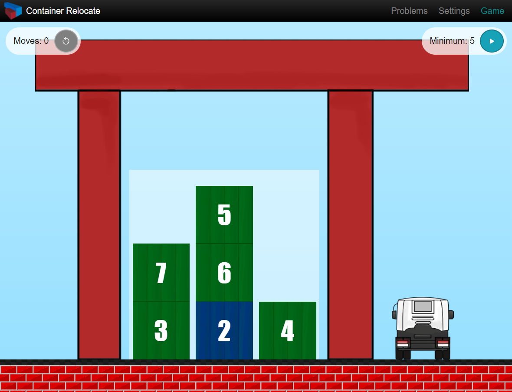

# Container Relocate

Container Relocate is a web application for practicing solutions to the restricted container relocation problem on the container terminal stacking area. The application consists of a React with Redux front-end (written in Typescript) with either .NET Core with Neo4j or Firebase with Firestore back-end. Developed as a final project for a B.D. in Computer Science.

## Introduction

Container Relocation Problem (also called Block Relocation Problem) is concerned with finding a sequence of container relocations that will result in the least number of relocations needed to retrieve all containers in the specified shipping order. Restricted Container Relocation Problem enforces that only the containers above the next scheduled container can be moved.

The problem is NP-complete but there are various A* search-based algorithms and heuristic approaches to finding a good enough solution.

The goal of this application is to provide a training ground for students interested in this problem and to also attract pupils to the Logistic and Management course at the Faculty of Maritime Studies.

## Technologies

### Frontend

Application is envisioned as a single-page application (SPA) written in React. From the get-go, Typescript was used to enforce good code practice and good project structure.

Since there are a lot of objects on the screen that have to be synced with one another, state management "was needed". For that purpose, Redux was added since it is the most popular state management library.

CSS is completely written from scratch and all the UI elements are hand-drawn specifically for this project. Animations are done using Framer motion library since it provided a better developer experience than purely coding them in CSS.

CSS is also responsive, and the application is treated as mobile-first.

### Backend

Bachelor's thesis version contains a backend written in C# and ASP.Net Core 3 (latest at the time). Neo4j was used for the database since it is a graph-based, schemaless, NoSQL database, it was a perfect fit for rapid integration into the project.

Version deployed to the Google Firebase microservices does not contain a traditional backend, instead, it relies on fetching data from the Firestore NoSQL Document database.